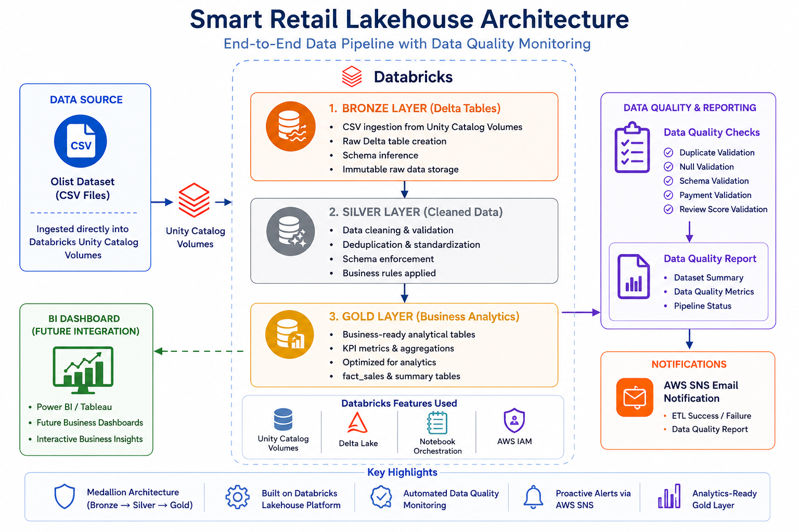

# Smart Retail Lakehouse with Automated Data Quality Monitoring

An end-to-end Data Engineering project that implements a modern Lakehouse architecture using **Databricks**, **PySpark**, **Delta Lake**, and **AWS SNS**. The project processes retail data through a Medallion Architecture (Bronze, Silver, Gold), performs automated data quality validation, generates business-ready analytical datasets, and sends ETL execution reports via Amazon SNS.

---

## 📌 Project Overview

This project demonstrates a scalable retail data pipeline built using the Medallion Architecture. Raw CSV files are transformed into optimized Delta tables through multiple ETL stages, ensuring high-quality, analytics-ready data.

The pipeline includes:

- Raw data ingestion into Unity Catalog Volumes
- Bronze, Silver, and Gold layer transformations
- Data quality validation
- Business analytics tables
- Automated ETL report generation
- Email notifications using AWS SNS
- Master pipeline orchestration

---

## 🚀 Features

- Medallion Lakehouse Architecture
- PySpark-based ETL Pipeline
- Delta Lake Storage
- Unity Catalog Managed Volumes
- Automated Data Quality Validation
- Business-ready Gold Layer Tables
- AWS SNS Email Notifications
- Master Pipeline Orchestration
- Modular Notebook Design

---

## 🏗️ Architecture

<p align="center">

</p>

---

## 🛠️ Technology Stack

| Category | Technologies |
|-----------|-------------|
| Data Processing | PySpark |
| Platform | Databricks |
| Storage | Delta Lake |
| Catalog | Unity Catalog |
| Programming | Python |
| Cloud | AWS SNS, AWS IAM |
| Version Control | Git, GitHub |

---

## 📂 Dataset

**Dataset:** Brazilian E-Commerce Public Dataset by Olist

The dataset contains:

- Customers
- Orders
- Order Items
- Products
- Sellers
- Payments
- Reviews
- Geolocation

Dataset Link:

https://www.kaggle.com/datasets/olistbr/brazilian-ecommerce

---

# 📊 ETL Pipeline

## Bronze Layer

The Bronze layer stores raw data as Delta tables with minimal transformations.

### Tasks Performed

- Read CSV files from Unity Catalog Volume
- Schema inference
- Convert raw data into Delta tables
- Preserve original records

---

## Silver Layer

The Silver layer cleans and validates the data.

### Transformations

- Duplicate removal
- Null value handling
- Data type validation
- Business rule validation
- Data standardization
- Review score validation
- Payment validation

---

## Gold Layer

The Gold layer contains analytics-ready datasets.

### Generated Tables

- fact_sales
- customer_summary
- product_performance
- seller_performance
- daily_sales_summary

These tables are optimized for reporting and business analytics.

---

# ✅ Data Quality Checks

The pipeline performs automated validation including:

- Duplicate Detection
- Null Value Validation
- Primary Key Validation
- Data Type Validation
- Review Score Validation
- Payment Validation
- Business Rule Validation

A comprehensive ETL execution report is generated after each successful pipeline run.

---

# 📧 AWS SNS Notification

After pipeline execution, the system automatically:

- Generates an ETL execution report
- Summarizes data quality metrics
- Sends an email notification using Amazon SNS

In case of pipeline failure, the Master Pipeline sends a failure notification with the corresponding error details.

---

# 📁 Project Structure

```
smart-retail-lakehouse-data-quality-monitoring
│
├── README.md
├── requirements.txt
├── .gitignore
│
├── notebooks/
│   ├── master_pipeline
│   ├── 01_bronze
│   ├── 02_silver
│   ├── 03_gold
│   └── 04_sns_notification
│
├── architecture/
│   └── architecture.png
│
├── results/
│   ├── pipeline_failes.png
|   └── pipeline_success.pdf
```

---

# ⚙️ Pipeline Workflow

```
Olist Dataset (CSV)
        │
        ▼
Unity Catalog Volume
        │
        ▼
Bronze Layer
        │
        ▼
Silver Layer
        │
        ▼
Gold Layer
        │
        ▼
Data Quality Report
        │
        ▼
AWS SNS Email Notification
```

---

# 📈 Business Analytics Tables

The Gold Layer provides business-ready datasets for analytics and reporting.

Examples include:

- Sales Performance
- Customer Analysis
- Product Performance
- Seller Performance
- Daily Sales Trends

These datasets can be directly connected to visualization tools such as **Power BI** or **Tableau**.

---

# ▶️ How to Run

1. Upload the Olist dataset into Unity Catalog Volumes.
2. Execute the **master_pipeline** notebook.
3. The pipeline automatically runs:
   - Bronze Layer
   - Silver Layer
   - Gold Layer
   - SNS Notification
4. Receive the ETL execution report via Amazon SNS.

---
## AWS Configuration

Before running the project, update the AWS credentials in the notebooks:

```python
AWS_ACCESS_KEY = "YOUR_AWS_ACCESS_KEY"
AWS_SECRET_KEY = "YOUR_AWS_SECRET_KEY"
AWS_REGION = "YOUR_REGION like us-east-1"
TOPIC_ARN = "YOUR_SNS_TOPIC_ARN"
```

Ensure your AWS IAM user has permission to publish messages to Amazon SNS.
---

# 🔮 Future Enhancements

- Power BI / Tableau Dashboard Integration
- AWS Lambda Trigger
- EventBridge Scheduling
- Databricks Jobs Orchestration
- Great Expectations Integration
- dbt Transformations
- CI/CD using GitHub Actions

---

# 👨‍💻 Author

**Sharun Gunti**

B.Tech – Computer Science and Engineering

VIT-AP University

---

## ⭐ If you found this project useful, consider giving it a star!
